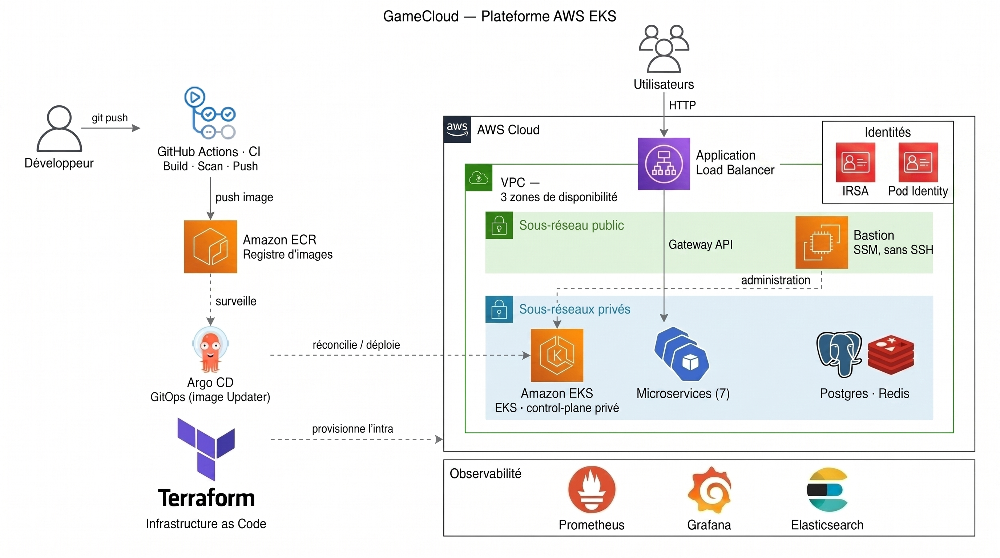

# GameCloud — Plateforme Cloud AWS

Une plateforme cloud AWS complète et réutilisable (VPC/EKS privé, CI/CD GitOps, réseau,
identités sans clé statique, observabilité), construite autour d'une application de démo à
7 microservices. La plateforme elle-même est le sujet : chaque brique est pensée pour
fonctionner avec n'importe quelle autre application.



## Ce qui est construit

- **Réseau privé** : VPC sur 3 zones de disponibilité, cluster EKS dont l'API n'est jamais
  exposée à Internet, accès admin uniquement via un bastion SSM (zéro clé SSH)
- **CI** : GitHub Actions, build, scan Trivy, push vers Amazon ECR taggé par SHA de commit,
  authentification OIDC (zéro clé AWS stockée dans GitHub)
- **CD GitOps** : ArgoCD (auto-sync, self-heal) piloté par une ApplicationSet + chart Helm
  générique, ArgoCD Image Updater pour un déploiement 100% automatique du commit au pod
- **Réseau applicatif** : Gateway API + AWS Load Balancer Controller → ALB public
- **Identités** : IRSA et EKS Pod Identity, les deux mécanismes sans clé AWS statique,
  démontrés et comparés
- **Observabilité** : métriques (Prometheus/Grafana) et logs (Elasticsearch/Kibana) réels

Documentation complète, avec commandes exactes, vérifications réelles et incidents
rencontrés (avec leur cause) : [`docs/aws-platform/GUIDE.md`](docs/aws-platform/GUIDE.md)
([English version](docs/aws-platform/GUIDE.en.md)).

Infrastructure provisionnée via Terraform, détruite et reconstruite plusieurs fois pendant
le build pour valider que rien ne dépend d'un état manuel du cluster.

---

## L'application

GameCloud est une arcade multi-jeux avec 7 microservices : `frontend`, `auth-api`,
`pendu-api`, `quiz-api`, `puissance4-api`, `memory-api`, `score-api`.

| Service | Stack | Port | Dépendance |
|---|---|---|---|
| `frontend` | Nginx + HTML/JS | `80` | — |
| `auth-api` | Flask (JWT) | `5001` | PostgreSQL |
| `pendu-api` | Flask | `5002` | Redis |
| `quiz-api` | Express | `3001` | — |
| `puissance4-api` | Flask (IA) | `5003` | Redis |
| `memory-api` | Express | `3002` | Redis |
| `score-api` | Express | `3003` | PostgreSQL |

Fonctionnalités : login/invité, 4 mini-jeux (Pendu, Quiz, Puissance 4, Memory), leaderboard
global, dashboard de santé des microservices.

### Environnement local (Kind)

Un environnement de développement local existe en parallèle de la plateforme AWS, pour
itérer sans dépendance cloud :

```bash
kind create cluster --config cluster/kind-config.yaml
./scripts/build-and-load.sh
./scripts/install-ingress-nginx-kind.sh
./scripts/deploy-gamecloud.sh
echo "127.0.0.1 gamecloud.local" | sudo tee -a /etc/hosts
./scripts/test-gamecloud.sh
```

Extension KEDA (scale-to-zero sur `score-api`) :

```bash
./scripts/install-keda.sh
kubectl apply -f k8s/scores/scaled-object.yaml
kubectl apply -f k8s/ingress/ingress-keda.yaml
./scripts/test-keda.sh
```

## Structure du dépôt

```text
infra/terraform/       # VPC, EKS, bastion, ECR, IAM/OIDC
deploy/helm/            # chart generique des microservices
deploy/kustomize/       # ressources partagees (datastores, Gateway API)
argocd/                 # Applications, ApplicationSet, Image Updater
observability/eck/      # Elasticsearch/Kibana/Filebeat
docs/aws-platform/      # guide complet (FR/EN) + captures d'ecran
.github/workflows/      # CI (build, scan Trivy, push ECR)

cluster/                # config Kind (dev local)
k8s/                    # manifests bruts (dev local)
services/               # code source des 7 microservices
scripts/                # scripts de dev local
```

## Documentation

- [Guide complet de la plateforme AWS](docs/aws-platform/GUIDE.md) ([English](docs/aws-platform/GUIDE.en.md))
- [TP complet GameCloud (Kind)](docs/TP_GAMECLOUD_COMPLET.md)
- [Extension KEDA](docs/TP_GAMECLOUD_KEDA.md)
- [Retour d'expérience DevOps](docs/RETOUR_EXPERIENCE.md)
