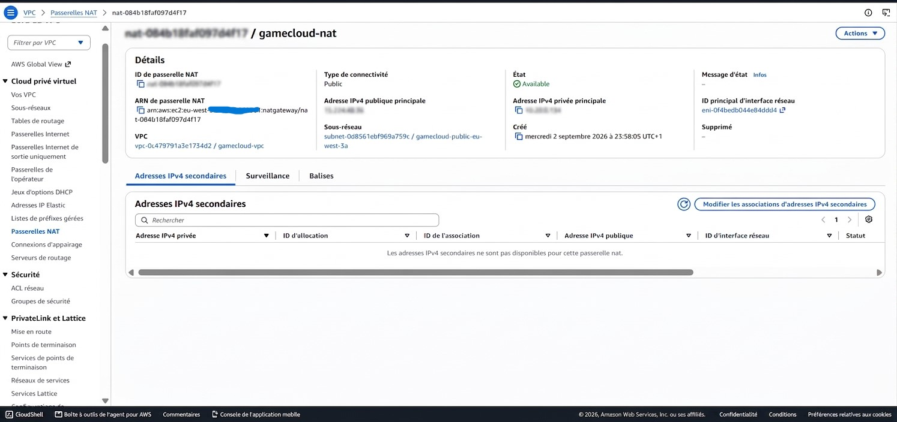
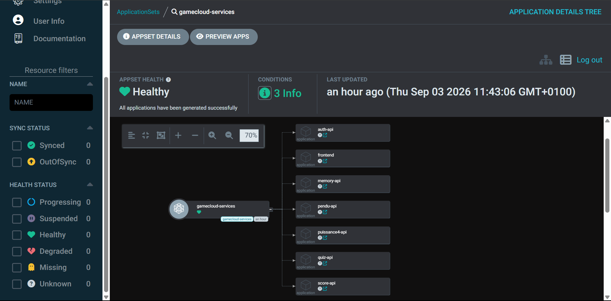
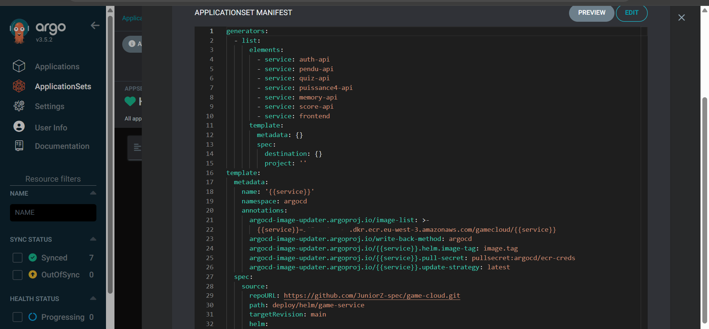
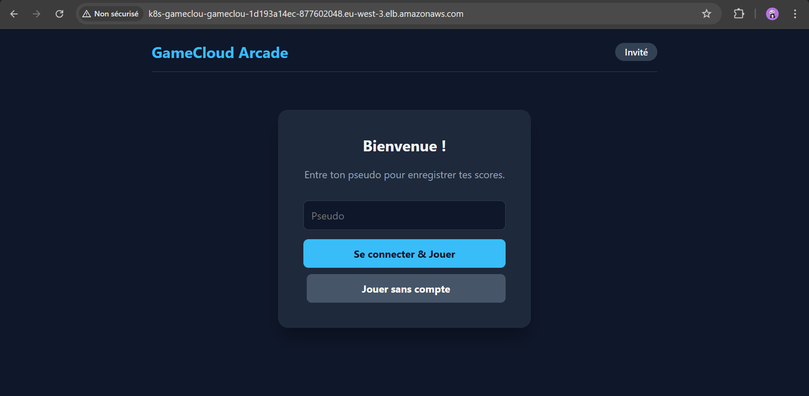

# GameCloud → AWS EKS Platform — Build Guide

`game-cloud` started as a school project: 7 microservices + Postgres/Redis on a local Kind
cluster, no CI/CD, fully ephemeral. This document covers how I built a real AWS cloud
platform around that application — private VPC/EKS, GitOps CI/CD, networking, identity,
observability, scaling — treating GameCloud as a "passenger app". The platform itself is
the point, not the game: every piece is designed to be reusable with any other application.

Documented phase by phase: what I build, why I made a given choice, and a real verification
at each step — not "should work", but the exact command and its output. Incidents are kept
as they happened, with their diagnosis, because they're part of the work.

---

## Phase 0 — Guardrails

Before touching any billable AWS resource, two free safety nets.

First, a budget alert. An AWS Budget watches account spend and emails me when a threshold
is crossed — just an alarm, blocks nothing, costs nothing. Real budget for the whole
project: ~$26, so the alert threshold is set at $20 for margin, with three email
notifications: actual spend > 80%, actual spend > 100%, and *forecasted* month-end spend >
100% (an early warning based on trend, before money is actually spent).

```bash
aws budgets create-budget --account-id <ACCOUNT_ID> \
  --budget file://budget.json \
  --notifications-with-subscribers file://notifications.json
```

`budget.json`: `{ "BudgetName": "gamecloud-aws-platform", "BudgetLimit": {"Amount": "20",
"Unit": "USD"}, "TimeUnit": "MONTHLY", "BudgetType": "COST" }`. `notifications.json` lists
the 3 thresholds above (80% actual, 100% actual, 100% forecasted), each with my email as
`Subscriber`.

Check: `aws budgets describe-budget --account-id <ACCOUNT_ID> --budget-name
gamecloud-aws-platform` returns `BudgetLimit.Amount = 20.0`.


Second, protecting the future Terraform state before writing the first `.tf` file.
Terraform will soon generate a `.tfstate` (its "memory" of what it created on AWS — without
it, it no longer knows what already exists) and a `.terraform/` plugin cache. Both are
excluded from Git now, since state can contain sensitive data in plaintext. Added to the
root `.gitignore`:

```gitignore
.terraform/
*.tfstate
*.tfstate.*
*.tfvars
!*.tfvars.example
crash.log
crash.*.log
```

One thing that matters: `.terraform.lock.hcl` is **not** ignored. Terraform recommends
committing it — it pins exact provider versions, like a `package-lock.json`.

Cost of this phase: $0.

---

## Phase 1 — Terraform: private VPC + EKS + bastion

### Bootstrap: where Terraform keeps its memory

Terraform constantly compares its `.tf` files (what I want) against its state (what
actually exists) to decide what to create, change, or destroy. Keeping that state only
locally is risky: losing it makes Terraform "forget" everything it created — resources
would keep running and costing money with no record of how to find them — and two
concurrent runs could corrupt the file without a lock. The standard fix is an S3 bucket
(versioned, encrypted, with history if a version gets corrupted) plus a DynamoDB table
acting as a lock, preventing two `terraform apply` runs at once.

This small bootstrap module deliberately keeps its own state local: it creates the very
bucket that will back everything else, so it can't store its own memory there before that
bucket exists — the classic chicken-and-egg problem.

Files: `infra/terraform/bootstrap/{main,variables,outputs}.tf`.

```bash
cd infra/terraform/bootstrap
terraform init && terraform apply -auto-approve
```

```bash
aws s3api head-bucket --bucket gamecloud-tfstate-<ACCOUNT_ID>-euw3
aws dynamodb describe-table --table-name gamecloud-tfstate-lock --query Table.TableStatus
```

Bucket reachable, table `ACTIVE` — remote backend ready.

### The VPC: an isolated private network

The VPC is the network holding the whole cluster, like a gated block where I control every
entry/exit. Spread across 3 availability zones — 3 physically separate data centers, for
resilience — with two subnet types: public (reachable from the internet, for the bastion
and the future ALB) and private (never directly reachable from outside, for the EKS
nodes). A single NAT Gateway, rather than one per AZ, lets private machines reach the
internet — pull a Docker image, call an AWS API — without being exposed themselves. A
deliberate cost trade-off for this demo project, at the price of a single point of failure
on outbound traffic. Subnets get the `kubernetes.io/cluster/<name>` and `role/elb` /
`internal-elb` tags right away, so EKS and the AWS Load Balancer Controller (phase 5)
auto-discover them later with no manual config.

Files: `infra/terraform/modules/vpc/`, wired into
`infra/terraform/{backend,providers,variables,main,outputs}.tf` against the remote state
created just before.

```bash
cd infra/terraform
terraform init && terraform apply -auto-approve
```

```bash
aws ec2 describe-vpcs --vpc-ids <id> --query "Vpcs[0].State"
aws ec2 describe-nat-gateways --filter "Name=vpc-id,Values=<id>" --query "NatGateways[0].State"
```

Both return `available`.

### Private EKS: the managed Kubernetes cluster

The centerpiece of this phase: an EKS cluster whose API is fully unreachable from the
internet (`endpoint_public_access = false`, `endpoint_private_access = true`). Only the
bastion, from inside the VPC, can talk to it. Around the cluster (with its IAM role), a
managed node group provides the EC2 machines that actually run pods, placed only in
private subnets. An OIDC provider is also set up here, unused for now — the technical
foundation for IRSA (phase 6), which will later let an IAM role trust tokens issued by
this specific cluster, with no AWS key ever stored in a pod.

Files: `infra/terraform/modules/eks/`.

The project's first real snag happened here: the node group stayed stuck 33 minutes in
`CREATE_FAILED`. Rather than wait and hope, I diagnosed it with `aws autoscaling
describe-scaling-activities --auto-scaling-group-name <asg>`, which showed `t3.medium` was
rejected — this AWS account restricts EC2 instances to Free-Tier-eligible types only,
likely a guardrail on a recent account. I listed the actually available types via `aws ec2
describe-instance-types --filters "Name=free-tier-eligible,Values=true"`:
`t3.micro/small`, `t4g.micro/small`, `c7i-flex.large`, `m7i-flex.large`. I picked
`m7i-flex.large` (8GB RAM / 2 vCPU) over a smaller type, anticipating that Prometheus,
Elasticsearch, the 7 microservices, and ArgoCD would all end up on the same nodes (phases
3 and 7).

```bash
terraform apply -auto-approve
```

```bash
aws eks describe-cluster --name gamecloud-eks --query "cluster.{Status:status,Public:resourcesVpcConfig.endpointPublicAccess}"
aws eks describe-nodegroup --cluster-name gamecloud-eks --nodegroup-name gamecloud-eks-main --query "nodegroup.{Status:status,Health:health}"
```

`ACTIVE` with `Public: false` — public access confirmed disabled — node group `ACTIVE`
with no issues.




The most important proof of this phase is the network isolation itself. From my local
machine, `aws eks update-kubeconfig --name gamecloud-eks --region eu-west-3` followed by
`kubectl get nodes` times out. The kubeconfig is valid, AWS credentials too, but the
Kubernetes API is physically unreachable from outside the VPC — concrete proof the setting
actually works, not just that it's declared in code.

### The bastion: the only way in

The only machine allowed to talk to the cluster. Accessed via AWS SSM Session Manager
instead of classic SSH: no open port, no key pair to manage or lose — the SSM agent on the
box connects outbound to AWS itself, never the other way around, so no inbound rule is
ever needed.

Worth understanding well: three independent authorizations must line up for access to
work. IAM first — the bastion's role must be allowed to call the AWS EKS API. Kubernetes
RBAC next — `aws_eks_access_entry` and `aws_eks_access_policy_association` grant that same
IAM role rights on the Kubernetes objects themselves, IAM and Kubernetes RBAC being two
separate permission systems on EKS. And finally the network: the control plane's security
group must explicitly allow traffic from the bastion's security group.

Files: `infra/terraform/modules/bastion/`, access resources in `infra/terraform/main.tf`.

That last point tripped me up: the first `kubectl get nodes` from the bastion failed with
`dial tcp ...:443: i/o timeout`, even though IAM and RBAC were correct. Cause: the
security group EKS manages for the control plane only allows traffic from its own nodes by
default, not from an external security group like the bastion's. Added an explicit
`aws_security_group_rule` (port 443, source = bastion SG), which fixed it — a clean
illustration that IAM, Kubernetes RBAC, and networking really are three independent
authorization layers on EKS, all three are required.

```bash
terraform apply -auto-approve
```

The test that actually matters here:

```bash
aws ssm send-command --instance-ids <id> --document-name AWS-RunShellScript \
  --parameters 'commands=["su - ec2-user -c \"kubectl get nodes\""]'
aws ssm get-command-invocation --command-id <id> --instance-id <id> --query StandardOutputContent
```

Both nodes show `Ready`, seen from the bastion, inside the VPC — combined with the earlier
confirmed failure from the local machine, that's full proof of the "private access only via
bastion" design.


Phase 1 cost, running continuously:

| Resource | ~$/hour |
|---|---|
| EKS control plane | $0.10 |
| 2× m7i-flex.large (nodes) | $0.22 |
| NAT Gateway | $0.05 |
| Bastion t3.micro | $0.01 |
| **Total** | **~$0.38/h** |

Phase 1 complete and verified, real incidents included.

---

## Phase 2 — GitHub Actions CI

### ECR and the GitHub ↔ AWS trust bridge

ECR is AWS's private Docker Hub equivalent: one repo per microservice (7 total), with
immutable tags (`IMMUTABLE` — a SHA tag, once pushed, can never be overwritten, matching
the idea that one tag = one exact commit) and a lifecycle rule keeping only the 10 most
recent images per repo, to avoid an ever-growing storage bill.

For GitHub Actions to push images without ever storing an AWS secret key in the repo — a
leak risk I wanted to avoid from the start — I set up an OIDC trust bridge: AWS trusts the
tokens GitHub automatically issues on every workflow run. The IAM role created is
assumable only by my exact repo (`repo:JuniorZ-spec/game-cloud:*`), with rights limited to
pushing to my 7 ECR repos — no other GitHub project, even on this same AWS account, can
use it.

Files: `infra/terraform/modules/{ecr,github-oidc}/`, wired into `infra/terraform/main.tf`.

Small snag along the way: `aws_iam_openid_connect_provider` failed with
`EntityAlreadyExists`. Turns out an OIDC provider for a given URL is unique per AWS
account, not per project — this account already had one, created by another personal
project (`ticketbus`). Replaced the create resource with a read (`data
"aws_iam_openid_connect_provider"`) of the existing provider; only the project's IAM role
stays GameCloud-specific.

```bash
terraform apply -auto-approve
```

```bash
aws ecr describe-repositories --query "repositories[].repositoryName"
aws iam get-role --role-name gamecloud-github-actions-ci --query Role.AssumeRolePolicyDocument
```

All 7 `gamecloud/*` repos are there, and the trust policy is correctly scoped to
`repo:JuniorZ-spec/game-cloud:*`.

### The workflow

`.github/workflows/ci.yml` chains two jobs. `detect-changes` uses the `dorny/paths-filter`
action to compare files changed in the push against `services/<name>/**` paths, producing
the list of actually touched services — if nothing under `services/` changed, nothing
runs. `build-scan-push` then runs a dynamic matrix over that list: one parallel job per
modified service, never all 7 at once. Each job gets short-lived AWS credentials via the
OIDC bridge, builds the Docker image, scans it with Trivy (the vulnerability report stays
visible in the logs but is non-blocking, so it doesn't break CI on a demo project's
not-yet-hardened codebase), then pushes to ECR tagged with `${{ github.sha }}` — the exact
SHA of the commit that produced it.

First real-world test: the `build-scan-push` job fails instantly at "Set up job", before
even checkout. Diagnosed via the GitHub API (`GET /repos/{repo}/check-runs/{id}/annotations`
— raw logs need admin rights even on a public repo): `Unable to resolve action
aquasecurity/trivy-action@0.28.0, unable to find version 0.28.0`. Turns out
`trivy-action` releases use a `v` prefix (`v0.28.0`, not `0.28.0`). Verified the real tags
via `curl https://api.github.com/repos/aquasecurity/trivy-action/tags` and fixed it to
`v0.36.0`, the latest stable release. Next run passed.

Verified in real conditions afterward: a commit touching only `services/auth-api/`
triggered exactly one job (`build-scan-push (auth-api)`), the other 6 untouched. The image
landed in `gamecloud/auth-api` tagged `d97bf26d8858a7913e2634b60c1d319d7155db2d` — the
exact SHA of the commit that produced it. The other 6 ECR repos verified empty (`aws ecr
describe-images --repository-name gamecloud/<svc> --query "length(imageDetails)"` returns
`0` everywhere except auth-api).


Phase 2 complete, tested under real conditions, incident included.

---

## Phase 3 — ArgoCD GitOps CD (Helm + Kustomize)

### Architecture choice

I first considered letting Kustomize compose a local Helm chart, but that's a fragile
technique — built for pulling *remote* charts, not composing a local one repeatedly. I
went with a more standard approach instead: Helm packages the application (one generic
`deploy/helm/game-service` chart, reused by all 7 microservices with different `values`),
Kustomize handles shared platform resources (`deploy/kustomize/base`: namespace,
StorageClass, Postgres, Redis), and ArgoCD orchestrates both through an ApplicationSet
(`argocd/applicationset-services.yaml`) — a `list` generator with 7 entries drives 7
`Application` objects from the same chart. Adding an 8th service, or an entirely different
app, only needs one line in the list plus a `values-<name>.yaml` file, nothing to
duplicate. That's exactly what makes the platform reusable, not just for GameCloud.

The `gamecloud-secrets` Secret (DB passwords, JWT) is deliberately not committed to Git —
created once by hand from the bastion (`kubectl create secret`, values generated randomly
via `openssl rand`). The kustomize base never references it as a resource, so an object
ArgoCD doesn't track is never overwritten by self-heal. This avoids repeating the
leaked-credential incident already documented in `RETOUR_EXPERIENCE.md`.

Files: `deploy/helm/game-service/` holds the generic chart (Deployment, Service,
ServiceAccount, conditional HPA) plus `values/values-<service>.yaml` for each of the 7
services. `deploy/kustomize/base/` holds the namespace, StorageClass, Postgres, and Redis
(adapted from `k8s/postgres` and `k8s/redis`, without the plaintext Secret).
`argocd/app-datastores.yaml` is the Application pointing at the kustomize base, and
`argocd/applicationset-services.yaml` drives the 7 services.

Installed from the bastion, over SSM:

```bash
helm repo add argo https://argoproj.github.io/argo-helm
helm upgrade --install argocd argo/argo-cd -n argocd --create-namespace --wait
kubectl create namespace gamecloud
kubectl create secret generic gamecloud-secrets -n gamecloud \
  --from-literal=POSTGRES_PASSWORD=$(openssl rand -hex 16) \
  --from-literal=JWT_SECRET=$(openssl rand -hex 24) ...
kubectl apply -f https://raw.githubusercontent.com/JuniorZ-spec/game-cloud/main/argocd/app-datastores.yaml
kubectl apply -f https://raw.githubusercontent.com/JuniorZ-spec/game-cloud/main/argocd/applicationset-services.yaml
```

(manifests applied straight from the raw GitHub URL — the repo is public, no need to clone
it onto the bastion)

### A cascade of incidents, all on the datastore side

On first deploy, 6 of the 7 microservices came up cleanly. The real problems clustered
around Postgres. First, `postgres` stayed `Pending` with `0/2 nodes are available: pod has
unbound immediate PersistentVolumeClaims`. Cause: an EKS cluster built from raw Terraform,
unlike one built with `eksctl`, doesn't install the EBS CSI driver by default — without it,
no PersistentVolume can be provisioned. Added `aws_eks_addon "aws-ebs-csi-driver"` with a
dedicated IRSA role in `infra/terraform/modules/eks/` — the project's very first real IRSA
usage, ahead of phase 6.

The PVC stayed Pending even after the driver was installed, this time with `no persistent
volumes available for this claim and no storage class is set`. The PVC specified no
`storageClassName` and no class was marked default on the cluster. Added an explicit `gp3`
StorageClass (`provisioner: ebs.csi.aws.com`) to the kustomize base rather than relying on
an ambiguous default.

Once the volume mounted, `postgres` went `CrashLoopBackOff` with `initdb: error: directory
"/var/lib/postgresql/data" exists but is not empty` — the EBS volume had a `lost+found`
directory created by its own filesystem. Standard fix: point `PGDATA` at a subdirectory of
the mount point (`/var/lib/postgresql/data/pgdata`).

`score-api`, cascading, was simply failing because `postgres` wasn't ready yet
(`ECONNREFUSED`) — resolved automatically once the three points above were fixed, confirmed
by a pod restart.

Every fix went through Git and was synced (`argocd app sync --core`, a mode that talks
directly to the Kubernetes API without exposing the ArgoCD UI) — never a `kubectl edit` or
manual cluster fix that would have drifted from Git.

```bash
kubectl get applications -n argocd
kubectl get pods -n gamecloud
```

8 `Application` objects (7 services + `gamecloud-datastores`), all `Synced`/`Healthy`; 9
pods `Running` (7 microservices + postgres + redis).




Phase 3 complete, 4 real incidents diagnosed and fixed via Git, no manual cluster fixes.

---

## Phase 4 — ArgoCD Image Updater

The point of this phase: close the loop so a code commit ends up deployed with zero manual
command typed between `git push` and the running pod.

A dedicated IAM role, read-only on ECR, assumable by the `argocd-image-updater`
ServiceAccount, is added in `infra/terraform/modules/eks/main.tf`. The Image Updater
itself is installed via Helm (`argo/argocd-image-updater`) on the bastion. Config lives in
`argocd/imageupdater.yaml`, with annotations set on `argocd/applicationset-services.yaml`.

Rather than creating a GitHub token with write access to the repo, I chose write-back on
the ArgoCD side (`write-back-method: argocd`): the tag is written as a Helm parameter
override on the Application via the Kubernetes API, not into the Git file. A deliberate
trade-off — deployment stays 100% automatic, but the exact deployed tag is no longer
visible in `values-*.yaml` on Git.

The longest chain of incidents in the project, each one reshaping my understanding of the
component. First, the installed version (`v1.3.0`, then confirmed identical on
`v1.2.4`/`v1.2.2`) no longer reads annotations globally as I initially assumed — it needs
an explicit `ImageUpdater` CRD object. Added `argocd/imageupdater.yaml` with
`useAnnotations: true` to keep reusing the annotations already in place.

Next, despite IRSA being correctly configured, I got `no basic auth credentials` on ECR.
Unlike what older documentation online describes, this version has no working native
ECR-via-IRSA detection, and no working external auth script either — the Helm
`registries.conf` value doesn't even wire into the ConfigMap in this version, and the
container has a read-only filesystem that breaks `aws ecr get-login-password` by default.
The only mechanism actually supported by the CRD turned out to be a `pullSecret`: a
`docker-registry` Kubernetes Secret, created once with an ECR token valid for ~12h.

Third surprise: the `pullSecret` set globally on the CR wasn't enough. Under
`useAnnotations: true`, the CR's global settings are ignored for everything except
application selection. Had to set `pullSecret` per service, as an annotation on the
ApplicationSet (`argocd-image-updater.argoproj.io/{{service}}.pull-secret`).

And one last problem, unrelated to Kubernetes itself: `helm upgrade --wait` made SSM
command status reporting hang indefinitely on long-running commands, several minutes with
no response. Worked around by dropping `--wait` and checking pod readiness separately with
short commands.

A known, accepted limitation: the `pullSecret`'s ECR token expires after ~12h; in
production, a CronJob would refresh it periodically. Out of scope here since the cluster
doesn't live that long.

The test that actually matters: a commit touching only `services/auth-api/Dockerfile`
(SHA `329faab...`) triggers the full chain —

```
CI (GitHub Actions): detect-changes -> build-scan-push (auth-api only) -> success
ECR: new image gamecloud/auth-api:329faab... pushed
Image Updater (next cycle, ~2 min): "images_considered=7 images_updated=1 errors=0"
                                     "Successfully updated application spec for auth-api"
ArgoCD: auth-api application re-synced automatically
```

```bash
kubectl get pods -n gamecloud -l app=auth-api -o jsonpath='{.items[0].spec.containers[0].image}'
kubectl get application auth-api -n argocd -o jsonpath='{.spec.source.helm.parameters}'
```

The pod's image is `.../gamecloud/auth-api:329faab4f0ea7082646984eb65a71777163d6eaa` —
exactly the commit SHA, with no `kubectl`/`argocd`/`docker push` typed manually after the
initial `git push`.



Phase 4 complete, end-to-end chain verified under real conditions.

---

## Phase 5 — Networking (Gateway API + AWS Load Balancer Controller)

The goal: replace the nginx Ingress from local Kind mode with a real public ALB, driven by
Gateway API — the standard succeeding Ingress. With no domain name, no need for
external-dns or an ACM certificate: plain HTTP via the DNS name AWS auto-generates.

IRSA for the controller (the project's official IAM policy, downloaded from AWS's repo) is
added in `infra/terraform/modules/eks/`. Gateway API CRDs and the controller install on the
bastion:

```bash
kubectl apply -f https://github.com/kubernetes-sigs/gateway-api/releases/download/v1.2.0/standard-install.yaml
helm upgrade --install aws-load-balancer-controller eks/aws-load-balancer-controller -n kube-system -f lbc-values.yaml
```

Files: `deploy/kustomize/base/gateway/` (GatewayClass, Gateway, HTTPRoute,
LoadBalancerConfiguration), plus
`deploy/helm/game-service/templates/targetgroupconfiguration.yaml`.

The project's richest phase in incidents, all tracing back to the same cause: Ingress-style
annotations (`alb.ingress.kubernetes.io/*`) simply aren't read on this controller's Gateway
API path — an architecture difference, not an isolated bug.

First symptom, `TargetGroup port is empty`: setting `target-type: ip` as an annotation on
the Gateway, then on each Service, had no effect. The real mechanism is a dedicated CRD,
`TargetGroupConfiguration` (`gateway.k8s.aws/v1`), linked to the Service via
`spec.targetReference`. Added one per service in the generic Helm chart.

Second symptom, an ALB created but stuck `internal-...` despite `scheme:
internet-facing` set as an annotation: same family of problem. The real mechanism is
`Gateway.spec.infrastructure.parametersRef`, pointing at a `LoadBalancerConfiguration` CRD
(`gateway.k8s.aws/v1`, `spec.scheme: internet-facing`).

Third symptom, `TargetGroupAssociationLimit` when changing the scheme afterward: AWS
refuses to reattach the same target groups to a new load balancer while the old one still
exists. Deleted the `Gateway` directly — ArgoCD's self-heal recreated it cleanly from Git,
with the correct config from creation, no live patching.

Proof of real public access:

```bash
aws elbv2 describe-load-balancers --query "LoadBalancers[?contains(DNSName,'gameclou')].{DNS:DNSName,State:State.Code,Scheme:Scheme}"
curl http://<dns-alb>/
curl http://<dns-alb>/api/auth/healthz
```

`Scheme: internet-facing`, `State: active`. The root path returns the frontend's real HTML
(`<title>GameCloud - ESGIS Arcade</title>`), and each `/api/<service>` path correctly
reaches its own backend — the 404 responses are distinct (Flask for auth-api, Express for
score-api), confirming correct routing rather than "it just responds". Tested from a real
public HTTP request, not through the SSM tunnel.



A fourth issue surfaced later, while preparing screenshots for this guide: the EC2 console
showed all 7 target groups as `Unhealthy` (health checks returning 404). Real traffic
wasn't actually broken — an ALB with 100% unhealthy targets in a target group still routes
traffic to them rather than returning 503 to everyone (AWS's documented "fail-open"
behavior), which explains why earlier `curl` calls worked despite this state. Real cause:
`TargetGroupConfiguration` specified no `healthCheckConfig`, so the ALB probed the default
`/` path on every service — which the frontend answers fine, but the 6 API microservices
don't, since they only implement `/healthz` (no `/` route at all). Fixed by adding a
per-service `healthCheckPath` in `values-*.yaml` (`/healthz` for the 6 APIs, `/` kept for
the frontend), read by the Helm chart into `healthCheckConfig.healthCheckPath` on
`TargetGroupConfiguration`. After an ArgoCD sync, all 7 target groups turned `healthy`
within a minute. A clean illustration that "curl responds" and "correctly configured" are
two different checks — the second nearly went unnoticed because the first was enough to
mask the problem.


Phase 5 complete, 4 real incidents resolved, public access verified.

---

## Cost discipline: tear down between sessions, rebuild on demand

Unlike local Kind (free), a real EKS cluster costs money continuously. Rule applied
systematically: as soon as a multi-hour break is coming, everything gets destroyed; on
return, everything gets rebuilt identically from code. The platform was torn down and
rebuilt 3 times total over the course of the project (after Phase 5, after Phase 6, after
Phase 7).

Teardown sequence, identical every time:

1. Remove `Gateway`/`HTTPRoute` from `deploy/kustomize/base/kustomization.yaml`, then
   ArgoCD sync with `prune` — never a direct `kubectl delete`, which ArgoCD's `selfHeal`
   would immediately undo. Mandatory step: without it, the ALB would be left orphaned (its
   controller disappears with the cluster) and would keep billing.
2. `terraform destroy` on `infra/terraform/` (VPC, EKS, bastion, ECR, IAM — the bootstrap
   S3/DynamoDB backend is kept).
3. Read-only check that everything is at 0: `aws eks list-clusters`, `describe-vpcs`,
   `describe-instances`, `describe-nat-gateways`, `describe-load-balancers`,
   `describe-repositories`, `terraform state list`.

Rebuild sequence: `terraform apply` (VPC+EKS+bastion+ECR+IAM, ~15-20 min), then
reinstalling the in-cluster tools (ArgoCD, Gateway API CRDs, ALB controller, Image Updater)
via the commands already documented above. All 3 rebuilds confirmed that no previously
fixed incident (EBS CSI, StorageClass, PGDATA, TargetGroupConfiguration,
LoadBalancerConfiguration, pull-secret) ever recurs, since every fix lives in Git — concrete
proof that the IaC/GitOps discipline holds. The only manual step repeated on every rebuild:
triggering a fresh CI build and updating image tags, since ECR repos come back empty every
time.

Two real incidents hit during these cycles, both fixed:

- **An accidental `apply` after a deliberate `destroy`.** To fix a small detail
  (`force_delete` missing on the ECR repos), I ran `terraform apply` instead of a fresh
  `destroy`. `apply` reconciles the entire desired state from code — since VPC/EKS/bastion
  were still defined in the `.tf` files, `apply` fully recreated them. Fixed with an
  immediate second `destroy`. Lesson: after a deliberate destroy, never `apply` for a minor
  fix — a targeted `destroy -target=...`, or `destroy` again.
- **A corrupted Terraform state lock.** `terraform apply` successfully created 63
  resources but failed releasing the DynamoDB lock (`unexpected end of JSON input`); even
  `terraform force-unlock` hit the same error. Fixed by deleting the stuck entry directly
  via `aws dynamodb delete-item`, after confirming via `aws dynamodb scan` it was indeed my
  own lock. Recurred once more, same fix, then worked around with `-lock=false` for the
  rest of that session. This DIY locking backend (already flagged as deprecated in Phase 1)
  seems to have a genuine occasional corruption bug — next step: migrate to `use_lockfile =
  true` (native S3 locking).

Every rebuild ended in the same state: 8 Applications `Synced`/`Healthy`, 9 pods `Running`,
public ALB active and verified via `curl` — all within 30 minutes.

---

## Phase 6 — Identity (IRSA + Pod Identity)

The goal here: demonstrate both AWS identity mechanisms for Kubernetes pods, without ever
storing a static AWS key in the cluster.

IRSA (IAM Roles for Service Accounts) is actually already heavily used since Phase 1: it's
the mechanism behind the EBS CSI driver, the AWS Load Balancer Controller, and the ArgoCD
Image Updater — each pod gets an IAM role via a federated OIDC token, the cluster's OIDC
provider set up back in Phase 1. Its function is already proven indirectly but concretely
at every previous phase: the EBS CSI driver creates real volumes, the ALB Controller
creates real load balancers, the Image Updater really reads ECR — none would have worked
without IRSA functioning.

Pod Identity is newer and simpler: no OIDC federation, just an "association" of
namespace + ServiceAccount → IAM role, managed by an agent (the `eks-pod-identity-agent`
EKS add-on). Demonstrated here on a dedicated component rather than relying on IRSA's
indirect proof alone.

Files: `infra/terraform/modules/eks/main.tf` for the add-on, IAM role, and association
(`aws_eks_pod_identity_association`), and
`deploy/kustomize/base/pod-identity-demo-sa.yaml` for the `pod-identity-demo`
ServiceAccount — with no annotation at all, which is exactly the key difference from IRSA:
the association lives on the AWS side, not in a Kubernetes annotation.

To compare both mechanisms directly, launched a throwaway pod with the
`pod-identity-demo` ServiceAccount:

```bash
kubectl run pod-identity-test -n gamecloud --image=public.ecr.aws/aws-cli/aws-cli \
  --overrides='{"spec":{"serviceAccountName":"pod-identity-demo"}}' --command -- sleep 300
kubectl exec pod-identity-test -n gamecloud -- aws sts get-caller-identity
```

Result: `Arn: arn:aws:sts::<ACCOUNT_ID>:assumed-role/gamecloud-eks-pod-identity-demo/...`
— an IAM role assumed with no key, no secret mounted in the pod.

What confirms these are genuinely two different mechanisms, not just two names for the same
thing, is the comparison of automatically injected environment variables:

| | IRSA (Image Updater pod) | Pod Identity (demo pod) |
|---|---|---|
| Key variables | `AWS_ROLE_ARN`, `AWS_WEB_IDENTITY_TOKEN_FILE` | `AWS_CONTAINER_CREDENTIALS_FULL_URI`, `AWS_CONTAINER_AUTHORIZATION_TOKEN_FILE` |
| Token path | `/var/run/secrets/**eks.amazonaws.com**/serviceaccount/token` | `/var/run/secrets/**pods.eks.amazonaws.com**/serviceaccount/...` |
| Mechanism | OIDC federation (JWT verified by IAM) | Local agent (`169.254.170.23`), no OIDC |


The test pod was deleted after verification (`kubectl delete pod pod-identity-test`) — a
throwaway resource, no residual cost.

Phase 6 complete: IRSA proven functional through 3 real components (EBS CSI, ALB
Controller, Image Updater), Pod Identity proven via a dedicated component with a direct
comparison of both mechanisms.

---

## Phase 7 — Observability (kube-prometheus-stack + EFK/ECK)

The goal: real metrics (Prometheus/Grafana/Alertmanager) and logs
(Elasticsearch/Kibana/Filebeat) from the cluster, not empty dashboards.

Like ArgoCD, the ALB controller, and the Image Updater, `kube-prometheus-stack` and the
ECK operator are installed imperatively via Helm — platform infrastructure. The
Elasticsearch/Kibana/Filebeat resources themselves, though, live in Git, managed by a
dedicated new ArgoCD Application (`gamecloud-observability`), consistent with the rest of
the project: the platform installs once, the content it manages goes through GitOps.

Files: `observability/eck/{elasticsearch,kibana,filebeat}.yaml`,
`argocd/app-observability.yaml`. Grafana/Prometheus persistence is disabled (6h retention)
to limit the number of EBS volumes on a demo project — Elasticsearch keeps a 5Gi (`gp3`)
volume to survive a pod restart during the session.

The only incident here: Filebeat, a 2-pod DaemonSet, went `CrashLoopBackOff` with `missing
field accessing 'filebeat.autodiscover.providers.0.node'`. The config references
`${NODE_NAME}` but that variable was never injected into the container. Fixed by adding
`env: NODE_NAME` via `fieldRef: spec.nodeName` (Downward API) on the DaemonSet's pod
template.

Proof that logs are genuinely being ingested, not an empty index:

```bash
kubectl exec -n monitoring gamecloud-logs-es-default-0 -- \
  curl -s -k -u elastic:<password> https://localhost:9200/_cat/indices?v
```

`.ds-filebeat-8.15.0-2026.09.04-000001 ... docs.count 12158 ... store.size 14.7mb` — over
12,000 real container logs from the cluster already indexed.

For access, the same SSM tunnel principle as ArgoCD:

```bash
kubectl port-forward svc/kube-prometheus-stack-grafana -n monitoring 8082:80
kubectl port-forward svc/gamecloud-kibana-kb-http -n monitoring 8083:5601
```

Grafana shows the pre-installed Kubernetes dashboards with real CPU/RAM metrics from the
cluster. Kibana, in its *Discover* view on the `filebeat-*` index, shows real logs from
every pod, GameCloud and platform alike.


Phase 7 complete, real logs and metrics verified.

---

## Third and final teardown (2026-09-04)

While preparing screenshots for this guide, I spotted the ALB health check incident
described in Phase 5 (all 7 target groups marked `Unhealthy`). Fixed and pushed to Git
before tearing anything down, with a forced ArgoCD sync to confirm live that all 7 target
groups turned `healthy`. Then a full teardown following the same sequence
(Gateway/HTTPRoute removed via Git, `terraform destroy`): 63 resources destroyed, everything
confirmed at 0. Real cost: $0/h. Only the bootstrap S3 bucket and DynamoDB table remain.

---

## What's next

Phases 0 through 7 built, verified, and documented with real proof. Remaining: scaling
(HPA + load generator) and a final write-up. As of this writing, the platform is torn
down (teardown above) — real cost: $0/h.
