# GameCloud → Plateforme AWS EKS — Guide de reproduction

`game-cloud` était au départ un TP ESGIS : 7 microservices + Postgres/Redis sur un cluster
Kind local, sans CI/CD, éphémère par nature. Ce document raconte comment j'ai construit une
vraie plateforme cloud AWS autour de cette application — VPC/EKS privé, CI/CD GitOps,
réseau, identités, observabilité, scaling — en traitant GameCloud comme une simple "app
passagère". La plateforme elle-même est ce que je voulais démontrer, pas le jeu : chaque
brique est pensée pour être réutilisable avec n'importe quelle autre application.

Je documente au fil de l'eau, phase par phase : ce que je construis, pourquoi je fais ce
choix plutôt qu'un autre, et surtout une vérification réelle à chaque étape — pas "ça
devrait marcher", mais la commande exacte et sa sortie. Les incidents rencontrés sont
gardés tels quels, avec leur diagnostic, parce qu'ils font partie du travail autant que le
résultat final.

---

## Phase 0 — Garde-fous

Avant de toucher à la moindre ressource AWS payante, je pose deux protections gratuites.

D'abord une alerte budget. Un "AWS Budget" surveille automatiquement la facturation du
compte et m'envoie un email quand un seuil est franchi — rien de plus qu'une alarme, ça ne
bloque rien tout seul et ça ne coûte rien. J'ai environ 26$ de budget réel pour tout le
projet, donc j'ai fixé le seuil d'alerte à 20$ pour garder de la marge, avec trois
notifications par email : dépense réelle > 80%, dépense réelle > 100%, et dépense
*prévisionnelle* de fin de mois > 100% (une alerte précoce, avant même d'avoir réellement
dépensé, si la trajectoire de consommation le laisse prévoir).

```bash
aws budgets create-budget --account-id <ACCOUNT_ID> \
  --budget file://budget.json \
  --notifications-with-subscribers file://notifications.json
```

`budget.json` contient l'essentiel : `{ "BudgetName": "gamecloud-aws-platform",
"BudgetLimit": {"Amount": "20", "Unit": "USD"}, "TimeUnit": "MONTHLY", "BudgetType": "COST" }`.
`notifications.json` liste les 3 seuils décrits plus haut (80% réel, 100% réel, 100%
prévisionnel), chacun avec mon email en `Subscriber`.

Vérification : `aws budgets describe-budget --account-id <ACCOUNT_ID> --budget-name
gamecloud-aws-platform` renvoie bien `BudgetLimit.Amount = 20.0`.

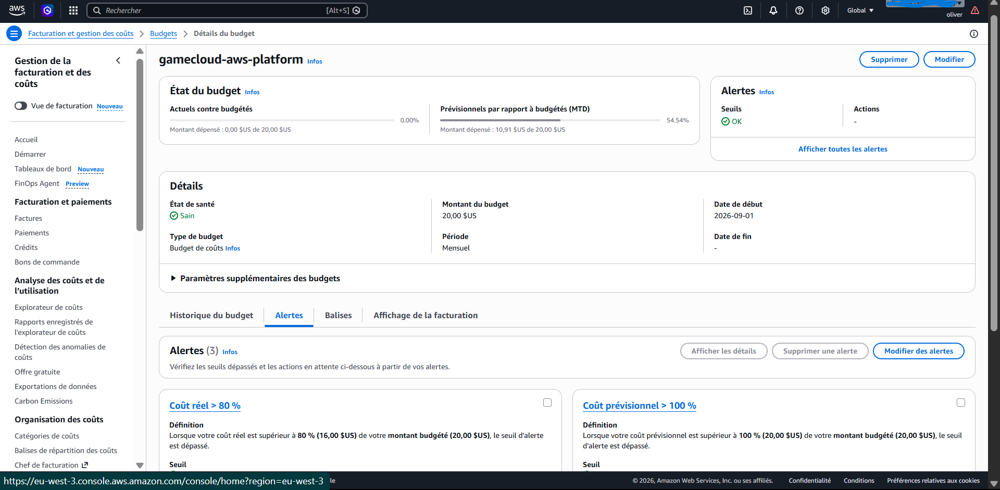

Ensuite, je protège le futur state Terraform avant même d'écrire le premier fichier `.tf`.
Terraform va bientôt générer un `.tfstate` (sa "mémoire" de ce qu'il a créé sur AWS — sans
lui il ne sait plus ce qui existe déjà) et un dossier `.terraform/` de cache de plugins. Les
deux sortent de Git dès maintenant, parce que le state peut contenir des données sensibles
en clair. J'ajoute au `.gitignore` racine :

```gitignore
.terraform/
*.tfstate
*.tfstate.*
*.tfvars
!*.tfvars.example
crash.log
crash.*.log
```

Une précision qui compte : `.terraform.lock.hcl` n'est **pas** ignoré. Terraform recommande
de le committer — il fixe les versions exactes des providers, un peu comme un
`package-lock.json`.

Coût de cette phase : 0$.

---

## Phase 1 — Terraform : VPC + EKS privé + bastion

### Bootstrap : où Terraform stocke sa mémoire

Terraform compare en permanence ses fichiers `.tf` (ce que je veux) à son state (ce qui
existe réellement) pour décider quoi créer, modifier ou détruire. Garder ce state seulement
en local est risqué : le perdre fait "oublier" à Terraform tout ce qu'il a créé — des
ressources continueraient de tourner et de coûter sans que je sache comment les retrouver —
et deux exécutions simultanées pourraient corrompre le fichier faute de verrou. La solution
standard est un bucket S3 (stockage versionné et chiffré, avec historique si une version se
corrompt) associé à une table DynamoDB qui sert de verrou, empêchant deux `terraform apply`
de s'exécuter en même temps.

Ce petit module de bootstrap garde volontairement son propre state en local : il crée
lui-même le bucket qui servira de backend à tout le reste, donc impossible d'y stocker sa
propre mémoire avant que ce bucket existe — le classique problème de l'œuf et la poule.

Fichiers : `infra/terraform/bootstrap/{main,variables,outputs}.tf`.

```bash
cd infra/terraform/bootstrap
terraform init && terraform apply -auto-approve
```

```bash
aws s3api head-bucket --bucket gamecloud-tfstate-<ACCOUNT_ID>-euw3
aws dynamodb describe-table --table-name gamecloud-tfstate-lock --query Table.TableStatus
```

Le bucket est accessible et la table passe `ACTIVE` — le backend distant est prêt.

### Le VPC : un réseau privé isolé

Le VPC est le réseau qui contient tout le cluster, un peu comme un quartier fermé dont je
contrôle chaque entrée/sortie. Je répartis sur 3 zones de disponibilité — 3 data centers
physiquement séparés, pour la résilience — avec deux types de sous-réseaux : publics
(accessibles depuis Internet, pour le bastion et le futur ALB) et privés (jamais joignables
directement depuis l'extérieur, pour les nœuds EKS). Une seule NAT Gateway, plutôt qu'une
par AZ, permet aux machines privées de sortir vers Internet — tirer une image Docker,
appeler une API AWS — sans être elles-mêmes exposées. C'est un choix d'économie assumé pour
ce projet démo, au prix d'un point de défaillance unique sur la sortie réseau. Les subnets
reçoivent dès maintenant les tags `kubernetes.io/cluster/<nom>` et `role/elb` /
`internal-elb`, pour qu'EKS et l'AWS Load Balancer Controller (phase 5) les découvrent
automatiquement sans configuration manuelle plus tard.

Fichiers : `infra/terraform/modules/vpc/`, branché dans
`infra/terraform/{backend,providers,variables,main,outputs}.tf` avec le state distant créé
juste avant.

```bash
cd infra/terraform
terraform init && terraform apply -auto-approve
```

```bash
aws ec2 describe-vpcs --vpc-ids <id> --query "Vpcs[0].State"
aws ec2 describe-nat-gateways --filter "Name=vpc-id,Values=<id>" --query "NatGateways[0].State"
```

Les deux répondent `available`.

### EKS privé : le cluster Kubernetes managé

Le point central de cette phase : un cluster EKS dont l'API est totalement inaccessible
depuis Internet (`endpoint_public_access = false`, `endpoint_private_access = true`). Seul
le bastion, depuis l'intérieur du VPC, pourra lui parler. Autour du cluster lui-même (avec
son rôle IAM), un node group managé fournit les machines EC2 qui exécutent réellement les
pods, placées uniquement dans les subnets privés. Je pose aussi un fournisseur OIDC, sans
encore l'utiliser — c'est la fondation technique d'IRSA (phase 6), qui permettra plus tard à
un rôle IAM de faire confiance aux tokens émis par ce cluster précis, sans qu'aucune clé AWS
ne soit jamais stockée dans un pod.

Fichiers : `infra/terraform/modules/eks/`.

Le premier vrai accroc du projet est arrivé ici : le node group est resté bloqué 33 minutes
en `CREATE_FAILED`. Plutôt que d'attendre en espérant, j'ai diagnostiqué avec `aws
autoscaling describe-scaling-activities --auto-scaling-group-name <asg>`, qui a montré que
`t3.medium` était refusé — ce compte AWS restreint les instances EC2 aux types éligibles
Free Tier uniquement, probablement une protection sur un compte récent. J'ai listé les types
réellement disponibles via `aws ec2 describe-instance-types --filters
"Name=free-tier-eligible,Values=true"` : `t3.micro/small`, `t4g.micro/small`,
`c7i-flex.large`, `m7i-flex.large`. J'ai retenu `m7i-flex.large` (8 Go RAM / 2 vCPU) plutôt
qu'un type plus petit, en anticipant que Prometheus, Elasticsearch, les 7 microservices et
ArgoCD allaient tous finir sur ces mêmes nœuds (phases 3 et 7).

```bash
terraform apply -auto-approve
```

```bash
aws eks describe-cluster --name gamecloud-eks --query "cluster.{Status:status,Public:resourcesVpcConfig.endpointPublicAccess}"
aws eks describe-nodegroup --cluster-name gamecloud-eks --nodegroup-name gamecloud-eks-main --query "nodegroup.{Status:status,Health:health}"
```

`ACTIVE` avec `Public: false` — l'accès public est bien désactivé — et le node group
`ACTIVE` sans anomalie.

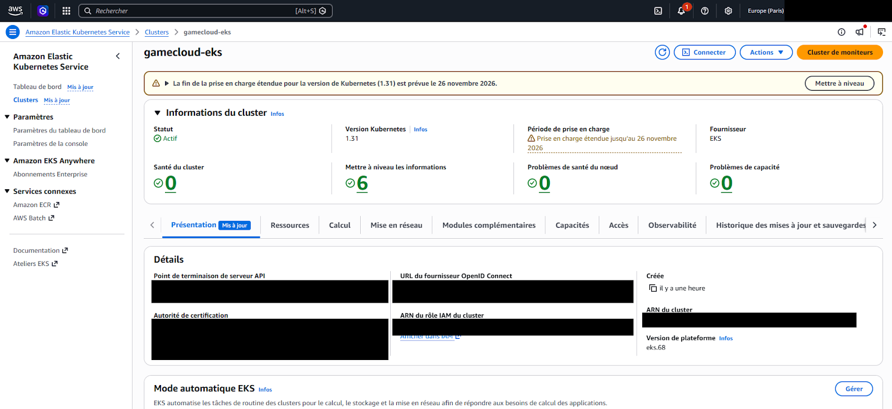

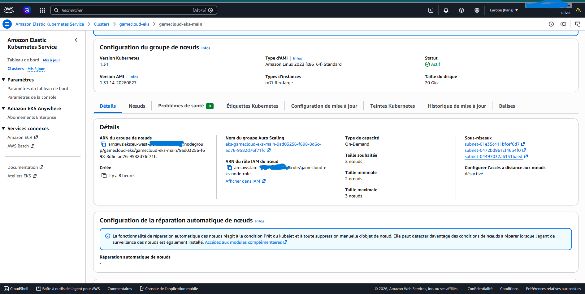

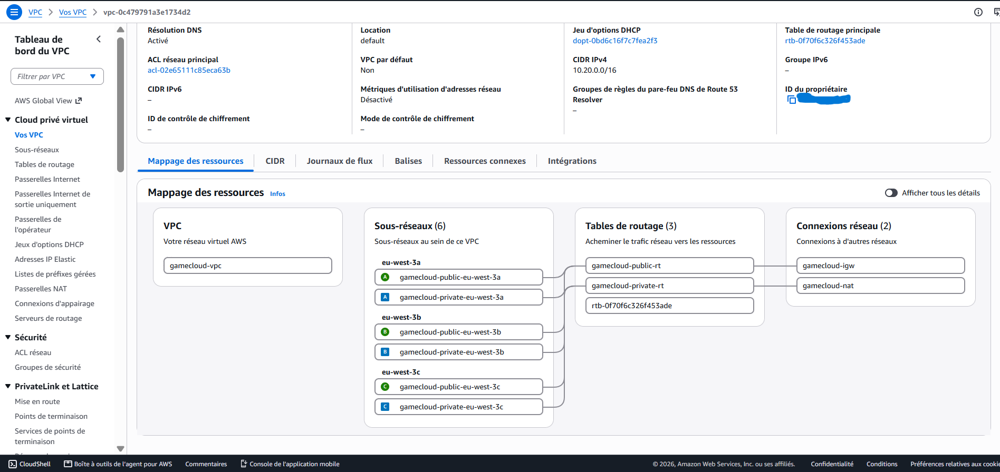

La preuve la plus importante de cette phase reste celle de l'isolation réseau elle-même.
Depuis mon PC local, `aws eks update-kubeconfig --name gamecloud-eks --region eu-west-3`
puis `kubectl get nodes` finit en timeout. Le kubeconfig est valide, les credentials AWS
aussi, mais l'API Kubernetes est physiquement injoignable depuis l'extérieur du VPC — la
preuve concrète que le paramètre fonctionne réellement, pas juste qu'il est déclaré dans le
code.

### Le bastion : la seule porte d'entrée

C'est la seule machine autorisée à parler au cluster. J'y accède via AWS SSM Session Manager
plutôt que par SSH classique : aucun port ouvert, aucune paire de clés à gérer ou à perdre —
l'agent SSM installé sur la machine se connecte lui-même en sortant vers AWS, jamais
l'inverse, donc pas besoin d'ouvrir la moindre entrée entrante.

Un point qui mérite d'être bien compris : trois autorisations indépendantes doivent
s'aligner pour que l'accès fonctionne. IAM, d'abord — le rôle du bastion doit avoir le droit
d'appeler l'API AWS EKS. RBAC Kubernetes ensuite — `aws_eks_access_entry` et
`aws_eks_access_policy_association` donnent à ce même rôle IAM des droits sur les objets K8s
eux-mêmes, IAM et RBAC Kubernetes étant deux systèmes de permissions séparés sur EKS. Et
enfin le réseau : le security group du control plane doit explicitement accepter le trafic
venant du security group du bastion.

Fichiers : `infra/terraform/modules/bastion/`, ressources d'accès dans
`infra/terraform/main.tf`.

Ce dernier point m'a d'ailleurs piégé : le premier `kubectl get nodes` depuis le bastion a
échoué avec `dial tcp ...:443: i/o timeout`, alors qu'IAM et RBAC étaient pourtant corrects.
La cause : le security group auto-géré par EKS pour le control plane n'autorise par défaut
que le trafic venant de ses propres nœuds, pas celui d'un security group externe comme celui
du bastion. J'ai ajouté une règle `aws_security_group_rule` explicite (port 443, source = SG
du bastion), et ça a débloqué la situation — une bonne illustration que IAM, RBAC Kubernetes
et réseau sont vraiment trois couches d'autorisation indépendantes sur EKS, il faut les
trois.

```bash
terraform apply -auto-approve
```

Le test qui compte vraiment ici :

```bash
aws ssm send-command --instance-ids <id> --document-name AWS-RunShellScript \
  --parameters 'commands=["su - ec2-user -c \"kubectl get nodes\""]'
aws ssm get-command-invocation --command-id <id> --instance-id <id> --query StandardOutputContent
```

Les 2 nœuds apparaissent `Ready`, vus depuis le bastion, à l'intérieur du VPC — combiné à
l'échec confirmé plus haut depuis le PC local, c'est la preuve complète du schéma "accès
privé uniquement via bastion".

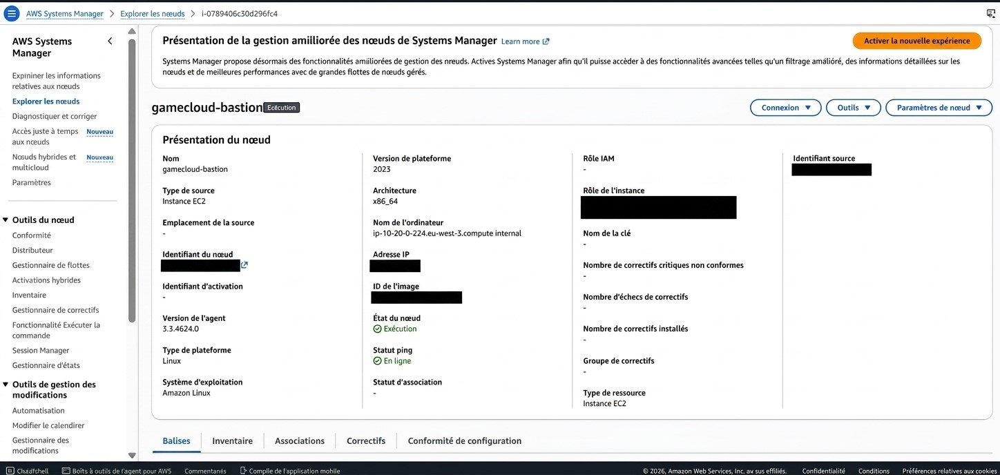

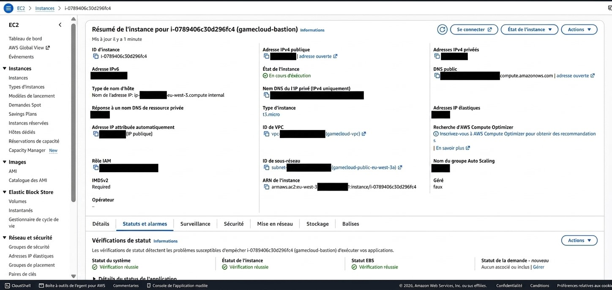

Coût de la phase 1, tout allumé en continu :

| Ressource | ~$/heure |
|---|---|
| EKS control plane | 0,10$ |
| 2× m7i-flex.large (nœuds) | 0,22$ |
| NAT Gateway | 0,05$ |
| Bastion t3.micro | 0,01$ |
| **Total** | **~0,38$/h** |

Phase 1 complète et vérifiée, incidents réels inclus.

---

## Phase 2 — CI GitHub Actions

### ECR et le pont de confiance GitHub ↔ AWS

ECR est l'équivalent AWS de Docker Hub, mais privé : un dépôt par microservice (7 au total),
avec des tags immuables (`IMMUTABLE` — un tag SHA une fois poussé ne peut jamais être
écrasé, cohérent avec l'idée qu'un tag correspond à un commit précis) et une règle de cycle
de vie qui ne garde que les 10 dernières images par dépôt, pour éviter une facture de
stockage qui grossit indéfiniment.

Pour que GitHub Actions puisse pousser des images sans qu'une clé AWS secrète ne soit jamais
stockée dans le dépôt — c'est un risque de fuite que je voulais éviter d'entrée — je mets en
place un pont de confiance OIDC : AWS fait confiance directement aux jetons que GitHub émet
automatiquement à chaque exécution de workflow. Le rôle IAM créé n'est assumable que par mon
repo précis (`repo:JuniorZ-spec/game-cloud:*`), avec des droits limités au push sur mes 7
dépôts ECR — aucun autre projet GitHub, même sur ce même compte AWS, ne peut l'utiliser.

Fichiers : `infra/terraform/modules/{ecr,github-oidc}/`, branchés dans
`infra/terraform/main.tf`.

Petit accroc au passage : `aws_iam_openid_connect_provider` a échoué avec
`EntityAlreadyExists`. Il se trouve qu'un fournisseur OIDC pour une URL donnée est unique
par compte AWS, pas par projet — ce compte en avait déjà un, créé par un autre projet
personnel (`ticketbus`). J'ai remplacé la ressource de création par une lecture (`data
"aws_iam_openid_connect_provider"`) du fournisseur existant ; seul le rôle IAM du projet
reste spécifique à GameCloud.

```bash
terraform apply -auto-approve
```

```bash
aws ecr describe-repositories --query "repositories[].repositoryName"
aws iam get-role --role-name gamecloud-github-actions-ci --query Role.AssumeRolePolicyDocument
```

Les 7 dépôts `gamecloud/*` sont là, et la trust policy est bien scopée à
`repo:JuniorZ-spec/game-cloud:*`.

### Le workflow

`.github/workflows/ci.yml` enchaîne deux jobs. `detect-changes` utilise l'action
`dorny/paths-filter` pour comparer les fichiers modifiés dans le push aux chemins
`services/<nom>/**`, et produit la liste des services réellement touchés — si personne n'a
touché à `services/`, rien ne se déclenche. `build-scan-push` ensuite tourne en matrice
dynamique sur cette liste : un job parallèle par service modifié, jamais les 7 à chaque
fois. Chaque job récupère des credentials AWS temporaires via le pont OIDC, build l'image
Docker, la scanne avec Trivy (le rapport de vulnérabilités reste visible dans les logs mais
non bloquant, pour ne pas casser la CI d'un projet démo sur une base pas encore à jour), puis
pousse vers ECR avec un tag `${{ github.sha }}` — le SHA exact du commit qui a produit cette
image.

Premier test en conditions réelles : le job `build-scan-push` échoue instantanément à "Set
up job", avant même le checkout. J'ai diagnostiqué via l'API GitHub (`GET
/repos/{repo}/check-runs/{id}/annotations`, les logs bruts nécessitent des droits admin même
sur un repo public) : `Unable to resolve action aquasecurity/trivy-action@0.28.0, unable to
find version 0.28.0`. Les releases de `trivy-action` utilisent en fait un préfixe `v`
(`v0.28.0`, pas `0.28.0`). J'ai vérifié les tags réels via `curl
https://api.github.com/repos/aquasecurity/trivy-action/tags` et corrigé vers `v0.36.0`, la
dernière version stable. Le test suivant est passé.

Vérifié en conditions réelles ensuite : un commit modifiant uniquement `services/auth-api/`
n'a déclenché qu'un seul job (`build-scan-push (auth-api)`), les 6 autres services restant
intacts. L'image a atterri dans `gamecloud/auth-api` avec le tag
`d97bf26d8858a7913e2634b60c1d319d7155db2d` — exactement le SHA du commit qui l'a produite.
Les 6 autres dépôts ECR sont vérifiés vides (`aws ecr describe-images --repository-name
gamecloud/<svc> --query "length(imageDetails)"` renvoie `0` partout sauf auth-api).

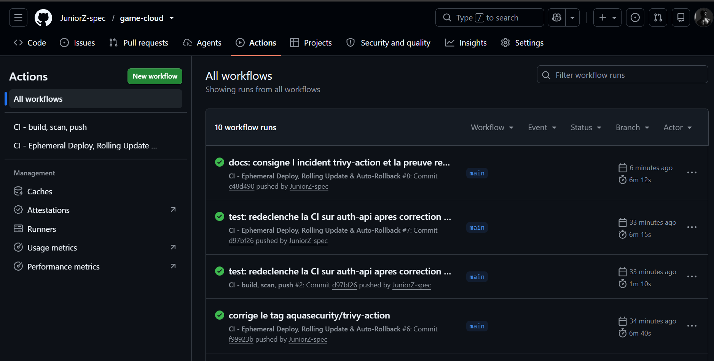

Phase 2 complète, testée en conditions réelles, incident inclus.

---

## Phase 3 — CD GitOps ArgoCD (Helm + Kustomize)

### Le choix d'architecture

J'ai d'abord envisagé de faire composer un chart Helm local par Kustomize, mais c'est une
technique fragile — pensée pour tirer des charts *distants*, pas pour en composer un local
plusieurs fois. J'ai préféré une approche plus standard : Helm packages l'application (un
seul chart générique `deploy/helm/game-service`, réutilisé par les 7 microservices avec des
`values` différentes), Kustomize gère les ressources partagées de la plateforme
(`deploy/kustomize/base` : namespace, StorageClass, Postgres, Redis), et ArgoCD orchestre
les deux via un ApplicationSet (`argocd/applicationset-services.yaml`) — un générateur
`list` de 7 entrées pilote 7 `Application` depuis le même chart. Ajouter un 8ème service, ou
une toute autre app, ne demande qu'une ligne dans la liste et un fichier
`values-<nom>.yaml`, rien à dupliquer. C'est précisément ce qui rend la plateforme
réutilisable, pas seulement pour GameCloud.

Le Secret `gamecloud-secrets` (mots de passe DB, JWT) n'est volontairement pas committé dans
Git — je le crée une seule fois à la main depuis le bastion (`kubectl create secret`,
valeurs générées aléatoirement par `openssl rand`). Le kustomize base ne le référence jamais
comme ressource, donc un objet non suivi par ArgoCD n'est jamais écrasé par le self-heal.
Ça évite de reproduire l'incident de clé committée déjà documenté dans
`RETOUR_EXPERIENCE.md`.

Côté fichiers : `deploy/helm/game-service/` porte le chart générique (Deployment, Service,
ServiceAccount, HPA conditionnel) plus les `values/values-<service>.yaml` pour chacun des 7
services. `deploy/kustomize/base/` porte le namespace, la StorageClass, Postgres et Redis
(adaptés de `k8s/postgres` et `k8s/redis`, sans le Secret en clair). `argocd/app-datastores.yaml`
est l'Application qui pointe sur le kustomize base, et `argocd/applicationset-services.yaml`
pilote les 7 services.

Installation depuis le bastion, via SSM :

```bash
helm repo add argo https://argoproj.github.io/argo-helm
helm upgrade --install argocd argo/argo-cd -n argocd --create-namespace --wait
kubectl create namespace gamecloud
kubectl create secret generic gamecloud-secrets -n gamecloud \
  --from-literal=POSTGRES_PASSWORD=$(openssl rand -hex 16) \
  --from-literal=JWT_SECRET=$(openssl rand -hex 24) ...
kubectl apply -f https://raw.githubusercontent.com/JuniorZ-spec/game-cloud/main/argocd/app-datastores.yaml
kubectl apply -f https://raw.githubusercontent.com/JuniorZ-spec/game-cloud/main/argocd/applicationset-services.yaml
```

(les manifests sont appliqués directement depuis l'URL brute GitHub — le repo est public,
pas besoin de le cloner sur le bastion)

### Une cascade d'incidents, tous côté datastore

Au premier déploiement, 6 des 7 microservices sont montés du premier coup. Les vrais
problèmes se sont concentrés sur Postgres. D'abord `postgres` restait bloqué en `Pending`
avec `0/2 nodes are available: pod has unbound immediate PersistentVolumeClaims`. La cause :
un cluster EKS créé via Terraform brut, contrairement à un cluster monté avec `eksctl`,
n'installe pas le driver CSI EBS par défaut — sans lui, aucun volume ne peut être
provisionné. J'ai ajouté `aws_eks_addon "aws-ebs-csi-driver"` avec un rôle IRSA dédié dans
`infra/terraform/modules/eks/` — le tout premier vrai usage d'IRSA du projet, en avance sur
la phase 6.

Le PVC restait Pending même après le driver installé, cette fois avec `no persistent volumes
available for this claim and no storage class is set`. Le PVC ne précisait aucune
`storageClassName` et aucune classe n'était marquée par défaut sur le cluster. J'ai ajouté
une `StorageClass gp3` explicite (`provisioner: ebs.csi.aws.com`) au kustomize base plutôt
que de dépendre d'une classe par défaut ambiguë.

Une fois le volume monté, `postgres` est parti en `CrashLoopBackOff` avec `initdb: error:
directory "/var/lib/postgresql/data" exists but is not empty` — le volume EBS contenait un
dossier `lost+found` créé par son propre filesystem. Le fix standard : pointer `PGDATA` vers
un sous-dossier du point de montage (`/var/lib/postgresql/data/pgdata`).

`score-api`, en cascade, plantait simplement parce que `postgres` n'était pas encore prêt
(`ECONNREFUSED`) — résolu automatiquement une fois les trois points ci-dessus corrigés,
confirmé par un redémarrage du pod.

Chaque correctif est passé par Git puis a été synchronisé (`argocd app sync --core`, un mode
qui parle directement à l'API Kubernetes sans exposer l'UI ArgoCD) — jamais de `kubectl
edit` ni de correction manuelle sur le cluster qui aurait divergé de Git.

```bash
kubectl get applications -n argocd
kubectl get pods -n gamecloud
```

8 `Application` (7 services + `gamecloud-datastores`), toutes `Synced`/`Healthy` ; 9 pods
`Running` (7 microservices + postgres + redis).

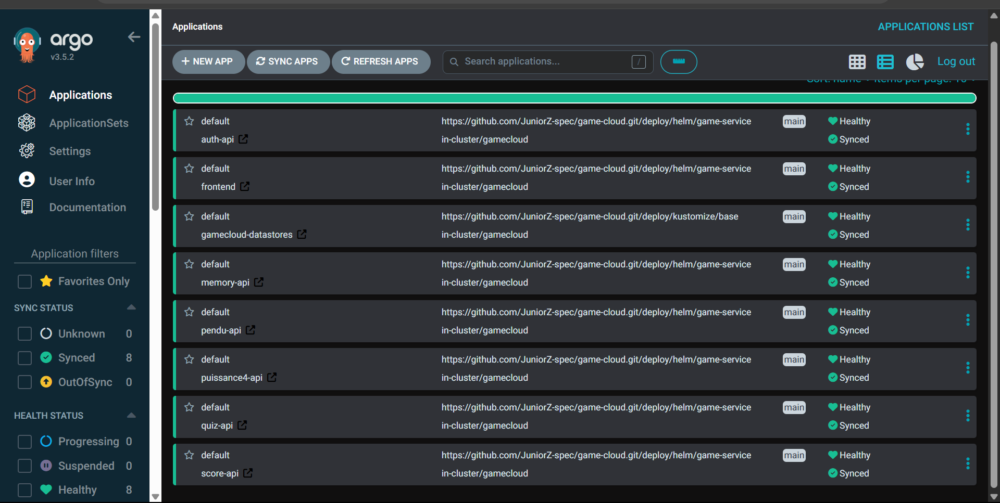

Phase 3 complète, 4 incidents réels diagnostiqués et corrigés via Git, jamais de correction
manuelle sur le cluster.

---

## Phase 4 — ArgoCD Image Updater

L'idée de cette phase est de fermer la boucle : un commit de code doit finir déployé sans
qu'aucune commande manuelle ne soit tapée entre le `git push` et le pod qui tourne.

Un rôle IAM dédié en lecture seule sur ECR, assumable par le ServiceAccount
`argocd-image-updater`, est ajouté dans `infra/terraform/modules/eks/main.tf`. L'Image
Updater lui-même est installé via Helm (`argo/argocd-image-updater`) sur le bastion. La
config vit dans `argocd/imageupdater.yaml`, avec des annotations posées sur
`argocd/applicationset-services.yaml`.

Plutôt que de créer un token GitHub avec accès en écriture au repo, j'ai choisi un
write-back côté ArgoCD (`write-back-method: argocd`) : le tag est écrit comme override sur
l'Application via l'API Kubernetes, pas dans le fichier Git. C'est un compromis assumé — le
déploiement reste 100% automatique, mais le tag exact déployé n'est plus visible dans
`values-*.yaml` sur Git.

C'est la série d'incidents la plus longue du projet, et elle mérite d'être racontée dans
l'ordre parce que chaque étape a changé ma compréhension du composant. D'abord, la version
installée (`v1.3.0`, puis vérifié identique en `v1.2.4`/`v1.2.2`) ne lit plus les
annotations globalement comme je le pensais au départ — il faut une ressource `ImageUpdater`
(CRD) explicite. J'ai ajouté `argocd/imageupdater.yaml` avec `useAnnotations: true` pour
réutiliser les annotations déjà posées.

Ensuite, malgré IRSA correctement configuré, j'obtenais `no basic auth credentials` sur ECR.
Contrairement à ce que documentent des versions plus anciennes en ligne, cette version n'a
aucun mécanisme natif de détection ECR via IRSA, ni de script d'authentification externe
fonctionnel — le `registries.conf` Helm ne se câble même pas dans le ConfigMap, et le
conteneur a un filesystem en lecture seule qui casse `aws ecr get-login-password` par
défaut. La seule option réellement supportée par la CRD s'est révélée être un `pullSecret` :
un Secret Kubernetes de type `docker-registry`, créé une fois avec un token ECR valide
environ 12h.

Troisième surprise : le `pullSecret` posé globalement sur la CR ne suffisait pas. En mode
`useAnnotations: true`, les réglages globaux de la CR sont ignorés pour tout sauf la
sélection des applications. Il a fallu poser le `pullSecret` par service, en annotation sur
l'ApplicationSet (`argocd-image-updater.argoproj.io/{{service}}.pull-secret`).

Et un dernier problème, sans lien avec Kubernetes lui-même : `helm upgrade --wait` bloquait
la remontée de statut SSM indéfiniment sur les commandes longues, plusieurs minutes sans
réponse. J'ai contourné en supprimant `--wait` et en vérifiant l'état des pods séparément
avec des commandes courtes.

Je note une limite connue et assumée : le token ECR du `pullSecret` expire après ~12h ; en
production, un CronJob le régénérerait périodiquement. C'est hors scope pour ce projet
puisque le cluster est détruit bien avant l'expiration.

Le test qui compte vraiment : un commit modifiant uniquement `services/auth-api/Dockerfile`
(SHA `329faab...`) déclenche la chaîne complète —

```
CI (GitHub Actions) : detect-changes -> build-scan-push (auth-api uniquement) -> succes
ECR : nouvelle image gamecloud/auth-api:329faab... poussee
Image Updater (cycle suivant, ~2 min) : "images_considered=7 images_updated=1 errors=0"
                                         "Successfully updated application spec for auth-api"
ArgoCD : application auth-api re-synchronisee automatiquement
```

```bash
kubectl get pods -n gamecloud -l app=auth-api -o jsonpath='{.items[0].spec.containers[0].image}'
kubectl get application auth-api -n argocd -o jsonpath='{.spec.source.helm.parameters}'
```

L'image du pod est bien `.../gamecloud/auth-api:329faab4f0ea7082646984eb65a71777163d6eaa` —
exactement le SHA du commit, sans qu'aucun `kubectl`/`argocd`/`docker push` n'ait été tapé
manuellement après le `git push` initial.

Phase 4 complète, chaîne bout-en-bout vérifiée en conditions réelles.

---

## Phase 5 — Réseau (Gateway API + AWS Load Balancer Controller)

L'objectif est de remplacer l'Ingress nginx du mode Kind local par un vrai ALB public,
piloté par Gateway API — le standard qui succède à Ingress. Comme je n'ai pas de nom de
domaine, pas besoin d'external-dns ni de certificat ACM : l'accès se fait en HTTP simple via
le nom DNS auto-généré par AWS.

IRSA pour le contrôleur (la policy IAM officielle du projet, téléchargée depuis le repo AWS)
est ajoutée dans `infra/terraform/modules/eks/`. Les CRDs Gateway API et le contrôleur
s'installent sur le bastion :

```bash
kubectl apply -f https://github.com/kubernetes-sigs/gateway-api/releases/download/v1.2.0/standard-install.yaml
helm upgrade --install aws-load-balancer-controller eks/aws-load-balancer-controller -n kube-system -f lbc-values.yaml
```

Fichiers : `deploy/kustomize/base/gateway/` (GatewayClass, Gateway, HTTPRoute,
LoadBalancerConfiguration), plus
`deploy/helm/game-service/templates/targetgroupconfiguration.yaml`.

Cette phase a été la plus longue en incidents du projet, et ils partagent tous la même
leçon : les annotations style Ingress (`alb.ingress.kubernetes.io/*`) ne sont tout
simplement pas lues sur le chemin Gateway API de ce contrôleur. Ce n'est pas un bug isolé,
c'est une différence d'architecture qu'il faut connaître.

Premier symptôme, `TargetGroup port is empty` : poser `target-type: ip` en annotation sur le
Gateway puis sur chaque Service n'avait aucun effet. Le vrai mécanisme est une CRD dédiée,
`TargetGroupConfiguration` (`gateway.k8s.aws/v1`), liée au Service via
`spec.targetReference`. J'en ai ajouté une par service dans le chart Helm générique.

Deuxième symptôme, un ALB créé mais bloqué en `internal-...` malgré `scheme:
internet-facing` posé en annotation : même famille de problème. Le vrai mécanisme est
`Gateway.spec.infrastructure.parametersRef`, qui pointe vers une CRD
`LoadBalancerConfiguration` (`gateway.k8s.aws/v1`, `spec.scheme: internet-facing`).

Troisième symptôme, `TargetGroupAssociationLimit` en changeant le scheme après coup : AWS
refuse de réassocier les mêmes target groups à un nouveau load balancer tant que l'ancien
existe. J'ai supprimé le `Gateway` directement — ArgoCD, via son self-heal, l'a recréé
proprement depuis Git, avec la bonne config dès la création, sans changement à chaud.

Preuve d'un accès public réel :

```bash
aws elbv2 describe-load-balancers --query "LoadBalancers[?contains(DNSName,'gameclou')].{DNS:DNSName,State:State.Code,Scheme:Scheme}"
curl http://<dns-alb>/
curl http://<dns-alb>/api/auth/healthz
```

`Scheme: internet-facing`, `State: active`. La racine renvoie le HTML réel du frontend
(`<title>GameCloud - ESGIS Arcade</title>`), et chaque chemin `/api/<service>` atteint bien
son propre backend — les réponses 404 sont distinctes (Flask pour auth-api, Express pour
score-api), ce qui confirme le bon routage plutôt que "ça répond" au hasard. Testé depuis une
requête HTTP publique réelle, pas depuis le tunnel SSM.

Un quatrième problème est apparu plus tard, en préparant des captures d'écran pour ce
document : la console EC2 affichait les 7 target groups en `Non sain` (health checks en
404). Le trafic réel n'était pourtant pas cassé — un ALB qui voit 100% de ses cibles
unhealthy dans un target group continue quand même à leur envoyer le trafic plutôt que de
répondre 503 à tout le monde (comportement "fail-open" documenté par AWS), ce qui explique
pourquoi les `curl` précédents fonctionnaient malgré cet état. La cause réelle :
`TargetGroupConfiguration` ne précisait aucun `healthCheckConfig`, donc l'ALB sondait le
chemin par défaut `/` sur chaque service — qui répond bien pour le frontend, mais pas pour
les 6 microservices API, qui n'implémentent que `/healthz` (jamais de route `/`). Corrigé
en ajoutant un `healthCheckPath` par service dans les `values-*.yaml` (`/healthz` pour les
6 API, `/` conservé pour le frontend), lu par le chart Helm dans
`healthCheckConfig.healthCheckPath` du `TargetGroupConfiguration`. Après un sync ArgoCD,
les 7 target groups sont repassés `healthy` en moins d'une minute. Bonne illustration que
"ça répond au curl" et "c'est correctement configuré" sont deux vérifications différentes —
la seconde a failli passer inaperçue parce que la première suffisait à masquer le problème.

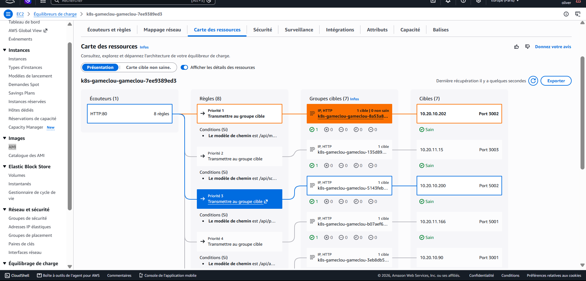

Phase 5 complète, 4 incidents réels résolus, accès public vérifié.

---

## Pause budget (2026-09-03) — destruction complète avant une coupure de plusieurs heures

Après la Phase 5, je devais m'absenter plusieurs heures. Conformément à ma discipline de
coût sur ce projet — rien ne tourne sans raison entre deux sessions — j'ai tout détruit.

D'abord le `Gateway`/`HTTPRoute`, retiré via Git (suppression de l'entrée dans
`deploy/kustomize/base/kustomization.yaml` puis sync ArgoCD avec `prune`) — jamais un
`kubectl delete` direct, qui aurait été immédiatement annulé par le `selfHeal` d'ArgoCD.
Cette étape est obligatoire avant de couper le cluster : sans elle, l'ALB, géré par un
contrôleur qui aurait disparu avec le cluster, serait resté orphelin et aurait continué à
facturer. Ensuite `terraform destroy` sur `infra/terraform/` — VPC, EKS, bastion, ECR, IAM —
tout sauf le bootstrap S3/DynamoDB, gardé pour la prochaine session.

Petite mésaventure au passage : pour corriger un détail (`force_delete` manquant sur les
dépôts ECR, qui bloquait leur suppression car non-vides), j'ai lancé un `terraform apply` au
lieu d'un nouveau `destroy`. Erreur de réflexe — `apply` réconcilie tout l'état désiré du
code, et comme le VPC/EKS/bastion étaient toujours définis dans les fichiers `.tf`
(seulement absents du state après le destroy), `apply` les a entièrement recréés. Corrigé
immédiatement par un second `terraform destroy`. La leçon que j'en retiens : après un
destroy volontaire, ne plus jamais lancer `apply` pour un correctif mineur — soit `destroy
-target=...` ciblé, soit corriger puis `destroy` à nouveau, jamais `apply`.

Vérification finale, en lecture seule, tout confirmé vide :

```bash
aws eks list-clusters
aws ec2 describe-vpcs --filters "Name=tag:Name,Values=gamecloud-vpc"
aws ec2 describe-instances --filters "Name=instance-state-name,Values=running,pending"
aws ec2 describe-nat-gateways --filter "Name=state,Values=available,pending"
aws elbv2 describe-load-balancers
aws ecr describe-repositories
terraform state list   # vide
```

0 partout. Coût réel après cette pause : 0$/h. Le bucket S3 et la table DynamoDB du
bootstrap restent (quelques centimes/mois), ainsi que tout le code sur GitHub — la prochaine
session repart avec `terraform apply` (VPC+EKS+bastion, ~15-20 min) puis réinstallation des
outils in-cluster (ArgoCD, Image Updater, Gateway API, contrôleur ALB — commandes déjà
documentées ci-dessus). Aucun des incidents déjà résolus ne devrait se reproduire puisque
les correctifs sont dans le code Git.

### Reconstruction confirmée, quelques heures plus tard le même jour

La prédiction s'est vérifiée : `terraform apply` (VPC+EKS+bastion+ECR+IAM, 59 ressources)
puis réinstallation des outils in-cluster (ArgoCD, CRDs Gateway API, contrôleur ALB, Image
Updater) — aucun des incidents précédents ne s'est reproduit. EBS CSI, StorageClass, PGDATA,
TargetGroupConfiguration, LoadBalancerConfiguration, pull-secret par service : tout a
fonctionné du premier coup, puisque les correctifs sont déjà dans le code. La seule action
manuelle nécessaire a été de relancer un build CI et de mettre à jour les fichiers
`values-*.yaml` avec le nouveau tag avant le premier sync ArgoCD, les dépôts ECR étant
repartis vides. Résultat : 8 Applications `Synced`/`Healthy`, 9 pods `Running`, nouvel ALB
public actif et vérifié par `curl`, le tout en moins de 30 minutes.

---

## Phase 6 — Identités (IRSA + Pod Identity)

L'objectif ici est de démontrer les deux mécanismes d'identité AWS pour des pods
Kubernetes, sans jamais stocker de clé AWS statique dans le cluster.

IRSA (IAM Roles for Service Accounts) est en fait déjà largement utilisé depuis la Phase 1 :
c'est le mécanisme derrière l'EBS CSI driver, l'AWS Load Balancer Controller et l'ArgoCD
Image Updater — chaque pod obtient un rôle IAM via un jeton OIDC fédéré, le fournisseur OIDC
du cluster posé dès la Phase 1. Son fonctionnement est déjà prouvé indirectement mais
concrètement à chaque phase précédente : l'EBS CSI driver crée de vrais volumes, l'ALB
Controller crée de vrais load balancers, l'Image Updater lit vraiment ECR — aucun n'aurait
fonctionné sans IRSA opérationnel.

Pod Identity est plus récent et plus simple : pas de fédération OIDC, juste une
"association" namespace + ServiceAccount → rôle IAM, gérée par un agent (l'add-on EKS
`eks-pod-identity-agent`). Je le démontre sur un composant dédié plutôt que de me contenter
de la preuve indirecte d'IRSA.

Fichiers : `infra/terraform/modules/eks/main.tf` pour l'addon, le rôle IAM et l'association
(`aws_eks_pod_identity_association`), et `deploy/kustomize/base/pod-identity-demo-sa.yaml`
pour le ServiceAccount `pod-identity-demo` — sans aucune annotation, ce qui est justement la
différence clé avec IRSA : l'association vit côté AWS, pas dans une annotation Kubernetes.

Pour comparer les deux mécanismes directement, j'ai lancé un pod jetable avec le
ServiceAccount `pod-identity-demo` :

```bash
kubectl run pod-identity-test -n gamecloud --image=public.ecr.aws/aws-cli/aws-cli \
  --overrides='{"spec":{"serviceAccountName":"pod-identity-demo"}}' --command -- sleep 300
kubectl exec pod-identity-test -n gamecloud -- aws sts get-caller-identity
```

Résultat : `Arn: arn:aws:sts::<ACCOUNT_ID>:assumed-role/gamecloud-eks-pod-identity-demo/...`
— un rôle IAM assumé sans aucune clé, aucun secret monté dans le pod.

Ce qui confirme que ce sont bien deux mécanismes distincts, et pas juste deux noms pour la
même chose, c'est la comparaison des variables d'environnement injectées automatiquement :

| | IRSA (pod Image Updater) | Pod Identity (pod de démo) |
|---|---|---|
| Variables clé | `AWS_ROLE_ARN`, `AWS_WEB_IDENTITY_TOKEN_FILE` | `AWS_CONTAINER_CREDENTIALS_FULL_URI`, `AWS_CONTAINER_AUTHORIZATION_TOKEN_FILE` |
| Chemin du token | `/var/run/secrets/**eks.amazonaws.com**/serviceaccount/token` | `/var/run/secrets/**pods.eks.amazonaws.com**/serviceaccount/...` |
| Mécanisme | Fédération OIDC (JWT vérifié par IAM) | Agent local (`169.254.170.23`), pas d'OIDC |

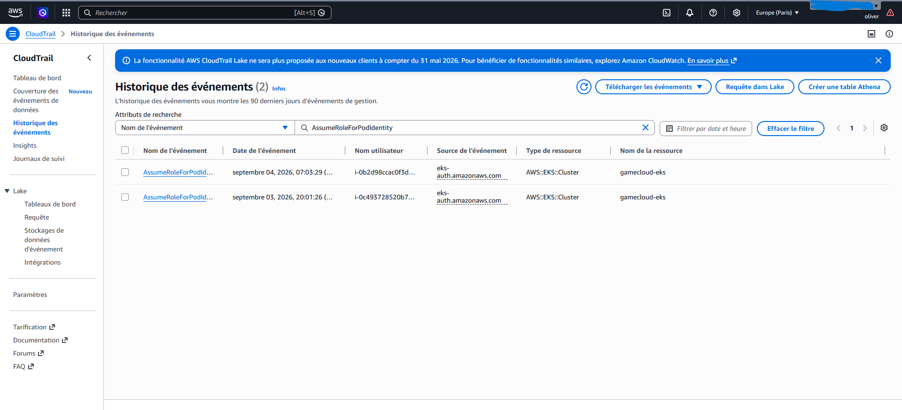

Le pod de test a été supprimé après vérification (`kubectl delete pod pod-identity-test`) —
c'était une ressource jetable, sans coût résiduel.

Phase 6 complète : IRSA prouvé fonctionnel via 3 composants réels (EBS CSI, ALB Controller,
Image Updater), Pod Identity prouvé via un composant dédié avec comparaison directe des deux
mécanismes.

---

## Pause budget #2 (2026-09-03, même jour) — après la Phase 6

Même procédure que la première pause : retrait du Gateway/HTTPRoute de Git avec sync ArgoCD
en `prune`, puis `terraform destroy`.

Cette fois, le Gateway est resté bloqué en suppression quelques dizaines de secondes —
`failed to delete securityGroup: ... DependencyViolation: resource sg-... has a dependent
object`. C'est une latence de cohérence AWS classique, le temps que les ENI/règles réseau
associées au security group managé du LB se détachent complètement avant que le security
group lui-même puisse être supprimé. Ça s'est résolu tout seul après un court délai, sans
aucune action de ma part — ce n'est pas une erreur bloquante, juste une question de patience
de quelques dizaines de secondes avant de lancer `terraform destroy`.

`terraform destroy` a ensuite réussi du premier coup (63 ressources, 0 erreur) — le
`force_delete` ajouté sur ECR après le premier teardown a fonctionné directement, aucune
correction en urgence cette fois. La vérification finale est identique à la première pause :
tout confirmé à 0 (EKS, VPC, instances, NAT, ALB, ECR, state Terraform vide).

---

## Reconstruction #2 (2026-09-04) — incident de verrou d'état Terraform

Même procédure de reconstruction que la première fois : `terraform apply`, réinstallation
des outils, rebuild CI, mise à jour des tags. Un service (`quiz-api`) a échoué au premier
essai CI avec une erreur de permission ECR — la propagation IAM n'était pas encore terminée
juste après la recréation du rôle `gamecloud-github-actions-ci` — résolu par un simple
nouveau commit déclenchant uniquement ce service.

Un incident plus sérieux est apparu cette fois : `terraform apply` a bien réussi à créer les
63 ressources mais a échoué en relâchant le verrou d'état (`Error releasing the state lock:
... unexpected end of JSON input`). Le verrou est resté bloqué dans la table DynamoDB, et
même `terraform force-unlock` échouait avec la même erreur de parsing. Ce backend de
verrouillage — déjà signalé comme déprécié en Phase 1, `use_lockfile` étant recommandé à la
place — semble avoir un vrai bug de corruption occasionnel. Je l'ai résolu en supprimant
directement l'entrée bloquée via `aws dynamodb delete-item`, après avoir confirmé via `aws
dynamodb scan` qu'il s'agissait bien de mon propre verrou. Un deuxième verrou corrompu est
réapparu au `terraform plan` suivant — même traitement, puis j'ai utilisé `-lock=false` pour
le reste de la session, ce qui est acceptable en solo mais à éviter en équipe. Piste pour la
suite : migrer vers `use_lockfile = true` (verrouillage natif S3, sans DynamoDB) pour
éliminer cette classe de bug.

Reconstruction complète confirmée : 8 Applications `Synced`/`Healthy`, 9 pods `Running`,
nouvel ALB public vérifié par `curl`.

---

## Phase 7 — Observabilité (kube-prometheus-stack + EFK/ECK)

Le but est d'avoir des métriques (Prometheus/Grafana/Alertmanager) et des logs
(Elasticsearch/Kibana/Filebeat) réels du cluster, pas des dashboards vides.

Comme pour ArgoCD, le contrôleur ALB et l'Image Updater, `kube-prometheus-stack` et
l'opérateur ECK sont installés de façon impérative via Helm — c'est de l'infrastructure de
plateforme. En revanche les ressources Elasticsearch/Kibana/Filebeat elles-mêmes vivent en
Git, gérées par une nouvelle Application ArgoCD dédiée (`gamecloud-observability`), cohérent
avec le reste du projet : la plateforme s'installe une fois, le contenu qu'elle gère passe
par GitOps.

Fichiers : `observability/eck/{elasticsearch,kibana,filebeat}.yaml`,
`argocd/app-observability.yaml`. J'ai désactivé la persistence Grafana/Prometheus (rétention
6h) pour limiter le nombre de volumes EBS sur un projet démo — Elasticsearch, lui, garde un
volume 5Gi (`gp3`) pour survivre à un redémarrage de pod pendant la session.

Le seul incident ici : Filebeat, en DaemonSet sur 2 pods, partait en `CrashLoopBackOff` avec
`missing field accessing 'filebeat.autodiscover.providers.0.node'`. La config référence
`${NODE_NAME}` mais cette variable n'était jamais injectée dans le conteneur. Corrigé en
ajoutant un `env: NODE_NAME` via `fieldRef: spec.nodeName` (Downward API) sur le pod
template du DaemonSet.

Preuve que les logs sont réellement ingérés, pas juste un index vide :

```bash
kubectl exec -n monitoring gamecloud-logs-es-default-0 -- \
  curl -s -k -u elastic:<password> https://localhost:9200/_cat/indices?v
```

`.ds-filebeat-8.15.0-2026.09.04-000001 ... docs.count 12158 ... store.size 14.7mb` — plus de
12 000 logs réels de conteneurs du cluster déjà indexés.

Pour l'accès, même principe de tunnel SSM que pour ArgoCD :

```bash
kubectl port-forward svc/kube-prometheus-stack-grafana -n monitoring 8082:80
kubectl port-forward svc/gamecloud-kibana-kb-http -n monitoring 8083:5601
```

Grafana affiche les dashboards Kubernetes préinstallés avec les vraies métriques CPU/RAM du
cluster. Kibana, dans sa vue *Discover* sur l'index `filebeat-*`, montre les logs réels de
tous les pods, GameCloud comme plateforme.

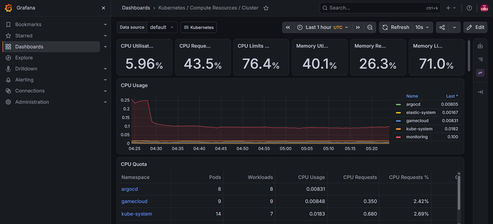

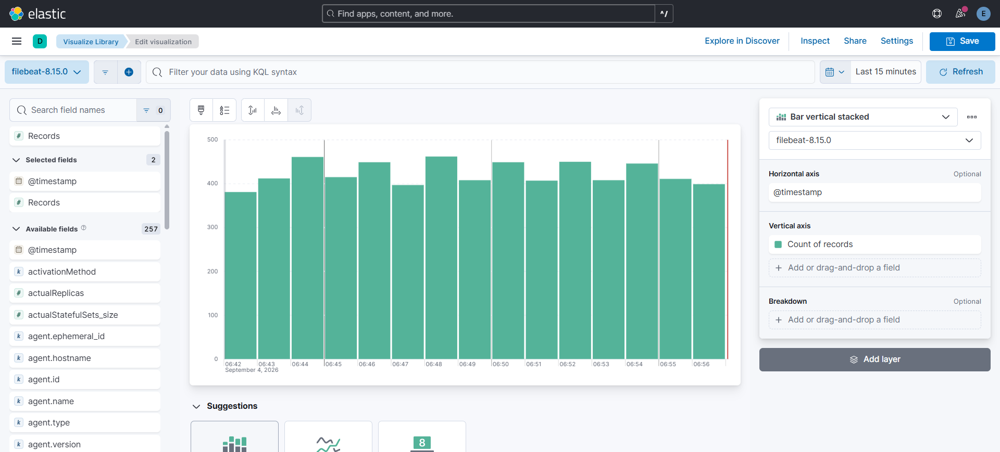

Phase 7 complète, logs et métriques réels vérifiés.

---

## Pause budget #3 (2026-09-04) — destruction complète après la Phase 7

Même procédure que les deux précédentes, avec un préalable en plus : en préparant les
captures d'écran de ce guide, j'ai repéré l'incident du health check ALB décrit en Phase 5
(les 7 target groups marqués `Non sain`). Corrigé et poussé sur Git avant de couper quoi que
ce soit, avec un sync ArgoCD forcé pour vérifier le résultat en direct (les 7 target groups
sont repassés `healthy` en moins d'une minute) plutôt que de laisser un doute sur l'état
réel de la plateforme au moment de la détruire.

Ensuite, séquence habituelle : retrait du `Gateway`/`HTTPRoute` de
`deploy/kustomize/base/kustomization.yaml`, sync ArgoCD avec `prune`, confirmation que
l'objet `Gateway` et l'ALB associé ont bien disparu côté AWS, puis `terraform destroy`.

```bash
aws elbv2 describe-load-balancers --query "LoadBalancers[?contains(DNSName,'gameclou')]"
terraform destroy -auto-approve
```

`terraform destroy` a réussi du premier coup, 63 ressources détruites, aucune erreur.
Vérification finale identique aux deux précédentes pauses — tout confirmé à 0 (EKS, VPC,
instances, NAT, ALB, ECR, state Terraform vide). Coût réel : 0$/h. Seuls le bucket S3 et
la table DynamoDB du bootstrap restent, comme à chaque pause.

---

## Phases suivantes (à venir)

- Phase 8 — Scaling (HPA + générateur de charge)
- Phase 9 — Documentation finale + destruction complète

Au moment d'écrire ces lignes, la plateforme est détruite (pause budget #3 ci-dessus) —
les phases 0 à 7 sont toutes construites, vérifiées et documentées avec preuves réelles ;
seules le scaling (Phase 8) et la synthèse finale (Phase 9) restent à faire lors d'une
prochaine reconstruction.
